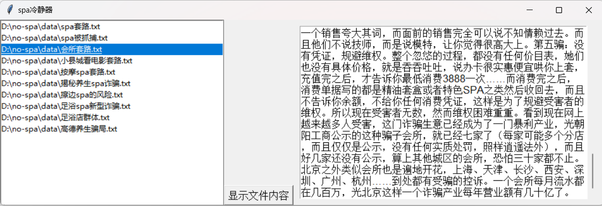

# no-spa
年轻人血气方刚沉迷作spa，容易被诱导消费，迷乱心智。因此做此软件。

# 数据源
1. 知乎

# log
- [x] 11/29，硬提取数据，从知乎上人工收集记录若干美团/抖音上的spa套路骗局，之所以被骗就是因为信息量的不足
- [x] 11/29，初步制作简单的gui界面，等后续添加其他功能，一起no spa... 
- [x] 11/29，初步做好，数据和代码分离，硬存储在d盘文件夹中。

